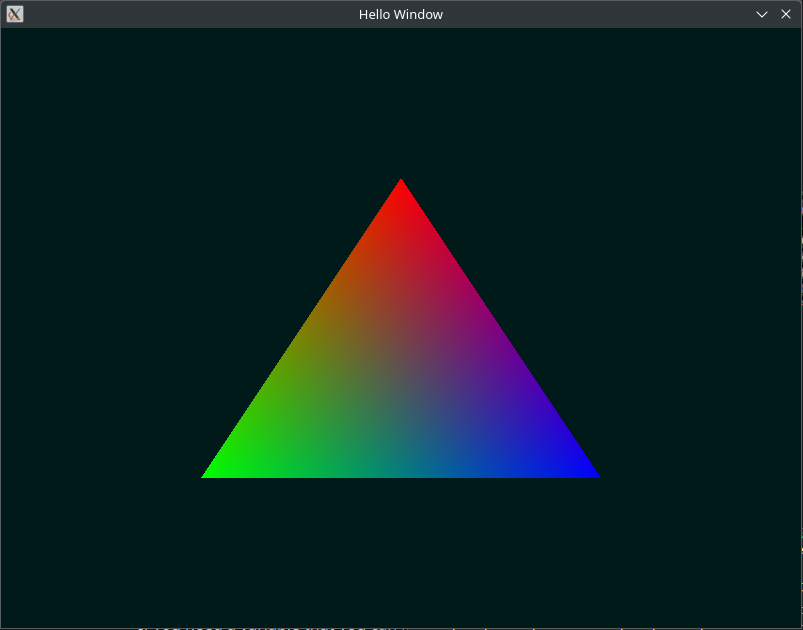

# Zig-Gfx

GFX is a lightweight window and graphics framework for zig.

It's aimed at being simple and easy to get started with. It allows you to work
directly with SDL3 and OpenGL while also providing a light-weight framework that 
abstracts away some of those details.

To use this you just need to add gfx.zig and vmath.zig to your project and include
references to glad, stb_image, stb_truetype, and stb_rect_pack to your build.zig

These are included in this repository, but you are free to attach them however you see fit.

You'll also have to install the SDL3 base library.

You can see build.zig here to see how they're added.

gfx.zig contains the sdl and opengl interface. You can access sdl and opengl directly through that module
or you can usually use one of the abstractions contained in gfx.zig. GFX abstractions only expect a single window
but if you need more you can use SDL3 directly. gfx.Init will initialize SDL, create a window, and create an OpenGL context for you. You can provide input hooks for gfx.PollEvents. This also includes an api for text rendering by leveraging stb_truetype and stb_rect_pack.

vmath.zig contains some basic linear algebra types and methods that are common for game development:
- SIMD vec2, vec3, vec4 and vector methods
- mat4 + transformation, lookAt, and projection functions
- quat + methods

- This is not inteded to be a comprehensive linear algebra library, and I am sure that there will be some
    functionality that is missing. The purpose is to provide a generic baseline that is most commonly used in games.


### A simple window example:
```zig
const std = @import("std");
const gfx = @import("gfx.zig");
const vmt = @import("vmath.zig");

const EventErrors = error{NullContext};

const AppContext = struct {
    running: bool,
};

const EventHooks = gfx.CreateEventHooks(AppContext, EventErrors);
const EventHooksType = EventHooks.EventHooks;

const VERTEX_SOURCE =
    \\#version 330 core
    \\layout(location = 0) in vec3 v_Position;
    \\layout(location = 1) in vec3 v_Color;
    \\
    \\out vec3 f_Color;
    \\
    \\void main(){
    \\  gl_Position = vec4(v_Position, 1.0);
    \\  f_Color = v_Color;
    \\}
;

const FRAGMENT_SOURCE =
    \\#version 330 core
    \\out vec4 FragColor;
    \\in vec3 f_Color;
    \\
    \\void main(){
    \\  FragColor = vec4(f_Color, 1.0);
    \\}
;

pub fn main() !void {
    const params = gfx.InitParams{
        .title = "Hello Window",
        .width = 800,
        .height = 600,
        .version = gfx.GLVersion{ .major = 3, .minor = 3, .core = true },
    };
    try gfx.Init(params);
    defer gfx.Quit();

    var context = AppContext{
        .running = true,
    };

    const eventHooks = EventHooksType{
        .on_quit = on_quit,
    };

    var vertex_format = gfx.VertexFormatBuffer{};
    try vertex_format.add_attribute(gfx.VertexType.Float3); // position
    try vertex_format.add_attribute(gfx.VertexType.Float3); // color

    const vertexBuffer = [_]f32{
        0.0,  0.5,  0.0, 1.0, 0.0, 0.0,
        -0.5, -0.5, 0.0, 0.0, 1.0, 0.0,
        0.5,  -0.5, 0.0, 0.0, 0.0, 1.0,
    };
    const indexBuffer = [_]u32{ 0, 1, 2 };

    var mesh = gfx.Mesh.init();
    defer mesh.destroy();

    try mesh.upload(&vertexBuffer, &indexBuffer, vertex_format);

    const shader = try gfx.Shader.create_from_source(VERTEX_SOURCE, FRAGMENT_SOURCE);
    defer shader.destroy();

    while (context.running) {
        try EventHooks.PollEvents(eventHooks, &context);

        gfx.gl.glClearColor(0, 0.1, 0.1, 1.0);
        gfx.gl.glClear(gfx.gl.GL_COLOR_BUFFER_BIT);

        shader.bind();
        mesh.present(gfx.Primitive.Triangles);

        gfx.SwapBuffers();
    }
}

fn on_quit(_: gfx.EventTy, context: ?*AppContext) EventErrors!void {
    if (context) |ctx| {
        ctx.running = false;
        return;
    }
    return error.NullContext;
}
```
### Result


## dependancies
* SDL3
* glad (included)
* stb_image (included)
* stb_truetype + stb_rect_pack (included)
* stb_perlin (optional + included)